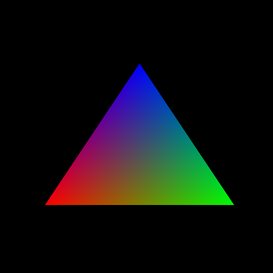

# GLCanvas-FX

A small project showing a single basic JavaFX control used to display contents from a JOGL `GLAutoDrawable` without relying on NEWT.

## Why though?

> "But why create this when you have NewtCanvasJFX?"

Great question.

The short answer is that if you look at the NEWT canvas, the only way to pass a `GLAutoDrawable` is by wrapping it in a `GLWindow` to satisfy the `Window` constructor and that may not be ideal.

To elaborate, this means your canvas is actually empty and taking a `Node.snapshot(SnapshotParameters, WritableImage)` will show nothing. The canvas actually is controlling the position and size of a separate window floating on top of it. For simple applications this may be fine, but this conflicts with a number of use-cases.

- You can't use `StackPane` to draw on top of the canvas
- You can't support mouse events on the canvas because the floating window will eat those
- You can't apply effects to the canvas, because its technically not the thing rendering the drawable

This implementation of `GLCanvas` for JavaFX mitigates _all_ of those problems.

## Example

See: [Example `Main`](src/test/java/software/coley/glcanvasfx/Main.java)

Video: https://www.youtube.com/watch?v=zf7g-EPNqdU

